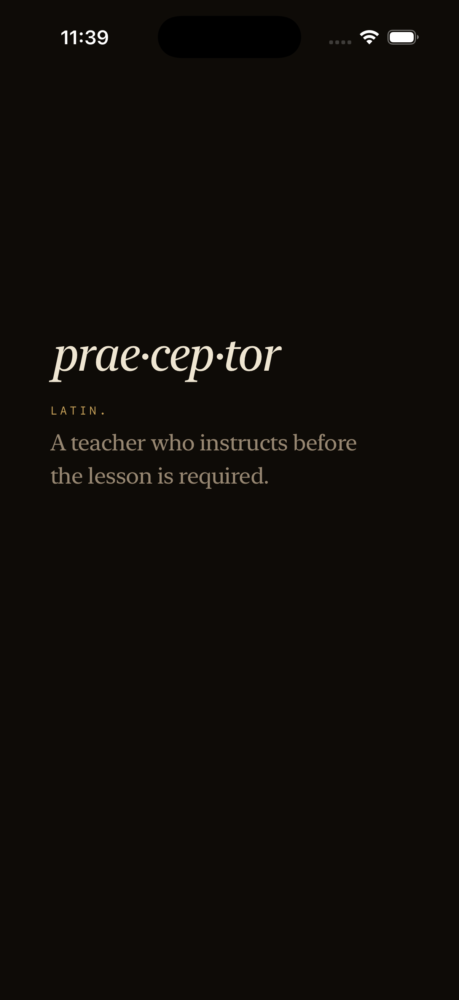
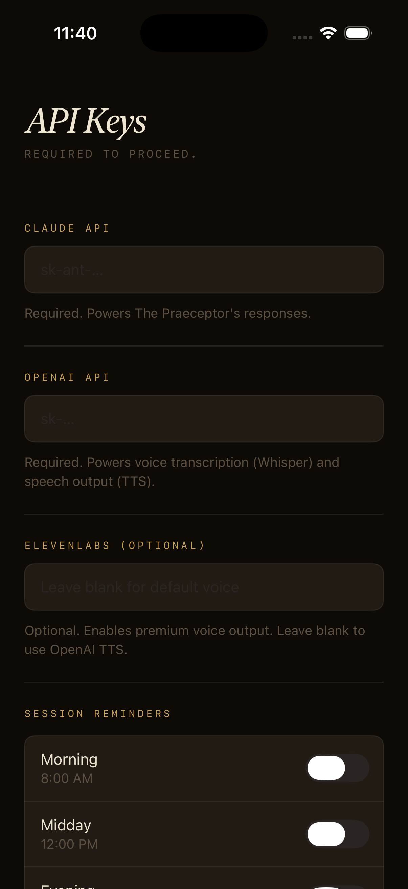
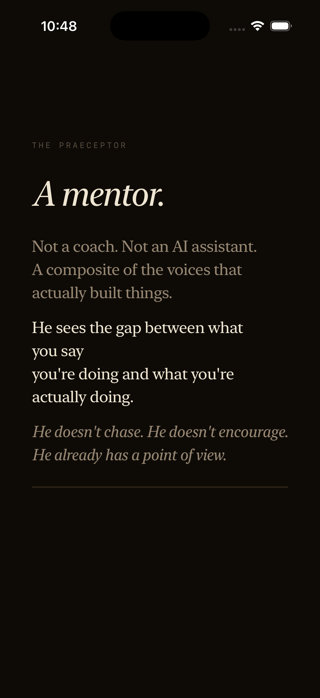
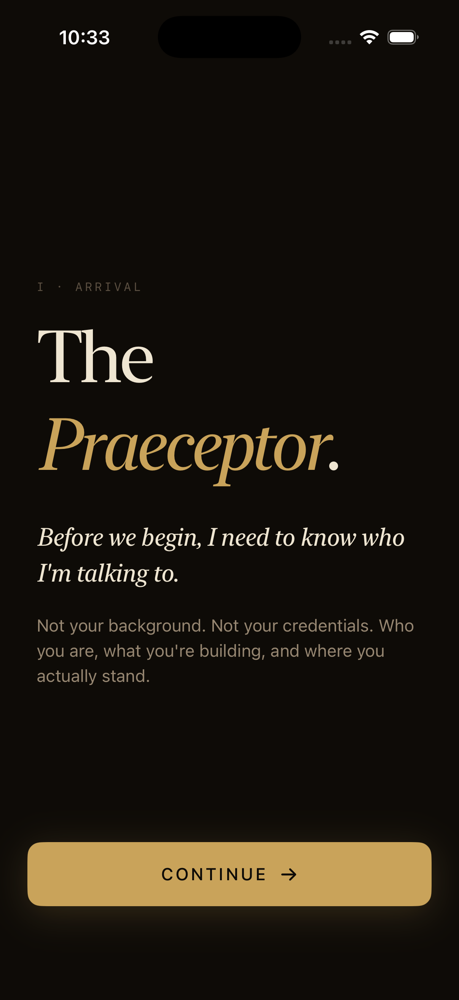
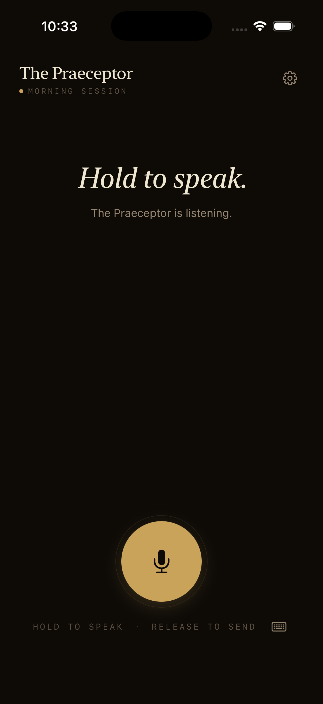

# Judge Guide — The Praeceptor
*Week 5 Competition · The Lyceum · May 2026*

A complete walkthrough for evaluating every layer of the submission: ICM folder, iOS app, voice pipeline, text fallback, persistence, widget, notifications, and Dynamic Island.

---

## Prerequisites

| Requirement | Version |
|-------------|---------|
| Xcode | 16+ (tested on Xcode 26.5 / Swift 6.3.2) |
| iOS Simulator | iPhone 17 Pro, iOS 18+ |
| Anthropic API key | **Required** — powers Claude responses |
| OpenAI API key | Optional — unlocks Whisper transcription + OpenAI TTS (onyx voice) |
| ElevenLabs API key | Optional — reserved for premium voice tier |

**If you have a Claude Pro or Max subscription**, your SDK API credits (~$20–$200/month) already cover this. Get your key at [console.anthropic.com](https://console.anthropic.com).

No CocoaPods or SPM dependency resolution needed. The project builds standalone.

---

## Step 1 — Open and Build

```
ios/Praeceptor.xcodeproj
```

1. Double-click to open in Xcode
2. Select `Praeceptor › iPhone 17 Pro` in the toolbar
3. `⌘R` — first build ~30 seconds

---

## Step 2 — Launch Experience

**Every cold launch begins with the splash screen.** No skip, no dismiss — it runs on every app open.



*"prae·cep·tor" — Latin. A teacher who instructs before the lesson is required.*

The definition fades in, holds for 2.5 seconds, then fades out. The app routes immediately after.

---

## Step 3 — API Key Setup

First launch routes to **Settings → API & Authorization** (no keys stored yet).



- Paste your **Anthropic API key** into the Claude field — this is the only required key
- OpenAI key is optional: enables Whisper transcription and OpenAI TTS (onyx voice)
- ElevenLabs key is optional: reserved for premium voice
- Tap **Save**

**Without an OpenAI key**, the app uses Apple's on-device voice pipeline by default:
- Transcription: `SFSpeechRecognizer` (runs locally, no network required)
- Voice output: `AVSpeechSynthesizer` (runs locally, no network required)

This means the app works with a Claude API key alone. No OpenAI account needed.

Keys are stored in the iOS Keychain with `.whenUnlockedThisDeviceOnly`. They survive app restarts and do not sync to iCloud.

> **API keys are never stored in code, config, or UserDefaults.** The only entry point is Settings → API & Authorization.

---

## Step 4 — Voice Settings (Optional)

If you have an OpenAI key, open **Settings → Voice** to upgrade your pipeline.

- **Transcription**: Apple (default, on-device) or OpenAI Whisper
- **Voice Output**: Apple (default) · OpenAI onyx · ElevenLabs (if key present)
- **Speaking Speed**: Slider 0.8–1.1, default 0.92

Provider options requiring a missing key are shown greyed — visible but not selectable.

---

## Step 5 — The Intro Flow (First Run Only)

After saving keys, first-time users see **The Praeceptor introduce himself**. This runs once — gate is `@AppStorage("editorial_seen")`.



**Phase 1** — The definition block fades in and out (same as the splash). Signals continuity of voice.

**Phase 2** — Four lines reveal sequentially:
- "THE PRAECEPTOR" (label)
- *"A mentor."* (display italic, 44px)
- "Not a coach. Not an AI assistant. A composite of the voices that actually built things."
- "He sees the gap between what you say you're doing and what you're actually doing."
- *"He doesn't chase. He doesn't encourage. He already has a point of view."*

A gold hairline appears below the last line. The **Continue** button fades in 1.2 seconds after.

Total time from launch to first interaction: ~10 seconds.

---

## Step 6 — Intake (7 Questions)

The intake builds the **KNOWING Layer** — the ≤800-token context JSON that The Praeceptor loads every session. Answer honestly; the responses go directly into the character context.



| # | Label | Question |
|---|-------|----------|
| I | Name | What's your name? |
| II | The Work | What are you actually building? |
| III | Where You Stand | Where do you stand right now? |
| IV | Original Thesis | What was the original thesis? |
| V | This Week | What are you working on right now? |
| VI | Commitment | What did you say you were going to do — and what did you actually do? |
| VII | What Surfaces | What's the one thing that keeps surfacing? |

Progress is shown as dot segments (active = full width, inactive = 6px circles). Back navigation is available on all questions.

Question VI is the Praeceptor's first signature question — it appears in intake deliberately.

---

## Step 7 — First Voice Session

After intake completes, the app routes to the **session screen**.



**Hold the center button** to start recording. Release to send.

**Default pipeline (Apple, no OpenAI key needed):**
1. Microphone permission prompt (first time) → grant it
2. Hold → `AVAudioSession` recording begins, Live Activity starts in the Dynamic Island
3. Release → `SFSpeechRecognizer` transcribes on-device
4. Double soft haptic fires on successful transcription
5. Claude Sonnet 4.6 streams the response with extended thinking (5000-token budget)
6. `AVSpeechSynthesizer` speaks the response aloud
7. Session close haptic ritual (heavy → medium → soft)

**With OpenAI key (Settings → Voice → OpenAI):**
- Transcription: Whisper API instead of `SFSpeechRecognizer`
- Voice output: OpenAI TTS (onyx, speed 0.92) instead of `AVSpeechSynthesizer`
- Pipeline otherwise identical

**What to say for a first session:** Describe what you're working on. The Praeceptor will ask one of his five signature questions or surface a gap between what you said in intake and what you're telling him now.

---

## Step 8 — Text Input Fallback

Voice is the primary interface — but text input is always available.

**To activate:** Tap the keyboard icon (⌨) in the footer, right of "RELEASE TO SEND."

The text input bar slides in. Type a message, tap the gold arrow to send. The mic button on the left returns to voice mode.

**Automatic activation:** If microphone permission is denied, the text bar opens automatically — no error screen, no dead end.

Text input bypasses the voice pipeline entirely. It feeds directly into the Claude + TTS pipeline. The response is identical to voice.

---

## Step 9 — Conversation Persistence

Sessions are stored via `ChatMessage` Codable with `.completeFileProtection` encryption.

**To verify persistence:**
1. Have a conversation (2–3 exchanges)
2. Kill the app (`⌘H` then swipe up in simulator, or terminate in Xcode)
3. Relaunch
4. After the splash, the session screen opens with the full conversation history intact

The KNOWING Layer (intake JSON) persists separately, also with `.completeFileProtection`.

After 3+ exchanges, the KNOWING layer updates automatically and silently using Claude Haiku — the next session The Praeceptor knows what surfaced in this one.

---

## Step 10 — Widget

The Praeceptor includes home screen widgets (small and medium).

**To add:**
1. Long-press the simulator home screen
2. Tap **+** (top left)
3. Search "Praeceptor"
4. Add **small** or **medium** widget

The widget displays the time-of-day session label and a character quote. Tapping the widget deep-links directly into the app and starts recording immediately (via URL scheme + `LaunchState.startRecording`).

---

## Step 11 — Session Reminders

In **Settings → Notifications**, enable time-of-day reminders.

Three toggles: Morning (8:00 AM), Midday (12:00 PM), Evening (6:00 PM).

Notifications use character-voiced copy — not generic reminders. The message changes based on time of day. The notification title reads the mentor's name from `UserDefaults` — if you've renamed your mentor in Settings → Mentor, notifications use that name.

---

## Step 12 — Dynamic Island / Live Activity

*Requires a real device or simulator with Live Activities enabled.*

During an active session, the Dynamic Island shows the current phase:
- **Compact** — session phase label (Recording / Thinking / Speaking)
- **Expanded** — phase detail with session label
- **Minimal** — accent dot
- **Banner** — appears when session starts

The Live Activity ends automatically when audio playback completes and the session returns to `.idle`.

---

## Evaluating the ICM Folder

The iOS app is the delivery mechanism. The folder is the character.

**To evaluate the folder directly in Claude:**
1. Create a new Claude Project
2. Upload: `CLAUDE.md`, `identity.md`, `rules.md`, `examples.md`, `patterns-pending.md`
3. Upload all files from `voice/` and `intake/`
4. In Project Instructions, paste the contents of `CLAUDE.md`
5. Start a conversation

The Praeceptor activates without the app. He should:
- Arrive with a point of view — not ask what you want
- Use questions to surface gaps, not to gather information
- Resist the mirror — if you deflect, he names the deflection
- Never encourage, validate, or summarize back what you said

Reference `examples.md` for explicit BAD (mirror/reactive) vs GOOD (formed mentor) contrast.

---

## Architecture Reference

| Layer | What It Does |
|-------|--------------|
| `CLAUDE.md` | Entry point — read order, two-layer architecture, Rule 0 |
| `identity.md` | The composite — 10 operators, voice, perspective, seven blind spots |
| `rules.md` | Behavioral contract: always, never, output format, routing |
| `voice/*.md` | Five signature questions, seven blind spots, failure stories, refusals |
| `intake/knowing-layer.md` | KNOWING layer schema — variable, ≤800 tokens, per-session |
| `examples.md` | BAD vs GOOD — mirror vs formed mentor |
| `ios/` | Swift 6, SwiftUI, iOS 18+, 86 unit tests |

---

## Test Suite

```bash
cd ios
xcodebuild test -project Praeceptor.xcodeproj \
  -scheme Praeceptor \
  -destination 'platform=iOS Simulator,id=<your-simulator-udid>'
```

86 tests across 11 classes. All green.

---

## If Something Breaks

| Issue | Fix |
|-------|-----|
| Build fails | `xcode-select --install` to update CLI tools |
| "Services not configured" error | Claude key not saved — go to Settings → API & Authorization |
| No audio output | Simulator volume: `⌥↑` to raise. Or use text input fallback. |
| Mic permission denied | Text input bar opens automatically. Or reset simulator permissions. |
| Black screen after splash | Keys missing — app routing to Settings. Normal behavior. |
| Voice sounds robotic | Using Apple TTS (default). Add OpenAI key in Settings → Voice for onyx voice. |

---

*The Praeceptor · Built for The Lyceum Week 5 · May 2026*
*Swift 6 · SwiftUI · iOS 18+ · Claude Sonnet 4.6 · Apple on-device voice (default) · OpenAI Whisper + TTS (optional)*
